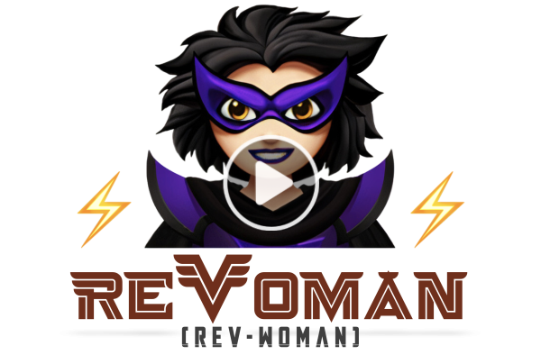

= ReṼoman (Rev-Woman)
Gopal S Akshintala <gopalakshintala@gmail.com>
:Revision: 1.0
ifdef::env-github[]
:tip-caption: :bulb:
:note-caption: :information_source:
:important-caption: :heavy_exclamation_mark:
:caution-caption: :fire:
:warning-caption: :warning:
endif::[]
:hide-uri-scheme:
:figure-caption!:
:prewrap!:
:revoman-version: 0.90.0

image:https://img.shields.io/maven-central/v/com.salesforce.revoman/revoman?style=flat-square&labelColor=1c1917&color=D97757&label=Maven%20Central[Maven Central,link=https://central.sonatype.com/artifact/com.salesforce.revoman/revoman]
image:https://img.shields.io/github/actions/workflow/status/salesforce-misc/ReVoman/build.yml?branch=master&style=flat-square&labelColor=1c1917&label=build[Build,link=https://github.com/salesforce-misc/ReVoman/actions/workflows/build.yml]
image:https://img.shields.io/github/stars/salesforce-misc/ReVoman?style=flat-square&labelColor=1c1917&color=D97757&logo=github&label=Star[GitHub stars,link=https://github.com/salesforce-misc/ReVoman]
image:https://img.shields.io/badge/JVM-21%2B-1c1917?style=flat-square&labelColor=1c1917[JVM 21+]
image:https://img.shields.io/github/license/salesforce-misc/ReVoman?style=flat-square&labelColor=1c1917&color=1c1917[License]

[.lead]
*ReṼoman* is an *API Orchestration Engine* for the JVM — the middleware between an agent and your API-Graphs.

Describe a workflow of interdependent API calls as *executable API metadata*. ReṼoman executes that graph on the JVM — resolving data dependencies between calls, handling auth, polling, and type-safe payloads — and hands back a structured *Rundown* of everything that happened. That makes it a building block for *Agentic API Orchestration*, with JVM API test automation as one powerful application.

📖 https://sfdc.co/revoman-docs[*Docs*] · https://salesforce-misc.github.io/ReVoman/revoman/getting-started.html[Get started] · https://salesforce-misc.github.io/ReVoman/revoman/why-revoman.html[Why ReṼoman?] · https://sfdc.co/revoman-slack[Slack]

NOTE: NO licensed Postman SDKs are used inside this project. This is written ground up natively in JVM. ReṼoman comes from the API-first SaaS company, *Salesforce*.

'''

== See it run

Hand the engine the executable API metadata you already author for manual testing. It runs the graph in order, threads each step's output into the next, and returns a Rundown you assert on — right inside your JVM stack.

....
  ReṼoman ▸ executing API-Graph ······································
   01   GET     /objects           200     88 ms   ✓
   02   POST    /objects           200    142 ms   ✓   → {id}
   03   PATCH   /objects/{id}      200    110 ms   ✓   ← {id}
   04   GET     /objects/{id}      200     76 ms   ✓   ← {id}
  ················································· 4 steps · 4 passed
   › rundown.toJson(VERBOSE)
   { "stepReports": [ 4 — all passed ], "mutableEnv": {…}, "stats": {…} }
....

The four steps above are a real, passing run against a deterministic local http4k-backed handler over a loopback socket — `POST` creates an object, and later steps reuse its `{id}`. ReṼoman ships the public `MockHttpServer`; `DeterministicMockApi` is this repository's application-specific example handler. The caller owns both, starts the server explicitly, and injects its URL into the run:

[source,java,tabsize=2]
----
final var api = new DeterministicMockApi();
try (final var server = MockHttpServer.start(api)) {
  final var rundown =
      ReVoman.revUp(                          // <1>
          Kick.configure()
              .templatePath(PM_COLLECTION_PATH)     // <2>
              .environmentPath(PM_ENVIRONMENT_PATH) // <3>
              .dynamicEnvironment("baseUrl", server.getBaseUrl()) // <4>
              .nodeModulesPath("js")
              .off());
  assertThat(rundown.firstUnsuccessfulStepReport()).isNull(); // <5>
  assertThat(rundown.stepReports).hasSize(4);                  // <6>
}
----
<1> `revUp` runs the graph, taking a configuration built with `Kick.configure()`
<2> An exported Postman collection JSON — your *executable API metadata*
<3> An exported Postman environment JSON
<4> Overlay the fixture's loopback URL
<5> Assert the run had no failures
<6> Assert on the structured https://salesforce-misc.github.io/ReVoman/revoman/rundown.html[Rundown]

`MockHttpServer` listens only on an ephemeral, exact IPv4 `127.0.0.1` address and is intended for
tests. It buffers request bodies in memory so they can be inspected through `server.requests()`.
Handlers may run concurrently, so their mutable state must be thread-safe; a blocking handler must
also cooperate with interruption when the server closes.

'''

== Why not just a collection runner?

https://learning.postman.com/docs/collections/using-newman-cli/command-line-integration-with-newman[Newman] and the Postman CLI overlap with ReṼoman only at "execute a collection." A runner emits a pass/fail report; ReṼoman is *middleware* that executes an API-Graph and returns structured context your JVM code — or an agent — builds on.

* *JVM-native.* Runs inside your JVM stack — coverage, assertions, and all. Newman/Postman CLI run on Node and can't.
* *Type-safe.* Its https://salesforce-misc.github.io/ReVoman/revoman/type-safety.html[Moshi bridge] hands responses back as POJOs you assert on directly, not raw JSON.
* *Richer execution model.* Dynamic https://salesforce-misc.github.io/ReVoman/revoman/hooks.html[pre/post-step hooks] plug custom JVM code between steps; polling, execution control, and a mutable environment are first-class.
* *A Rundown, not a report.* The https://salesforce-misc.github.io/ReVoman/revoman/rundown.html[Rundown] is far richer than a newman report — it is the structured Context Information an https://salesforce-misc.github.io/ReVoman/revoman/agentic-orchestration.html[agentic orchestration] loop reasons over.

== Install

Minimum Java version required = *21*

[.lead]
Maven
[source,xml,subs=attributes+,tabsize=2]
----
<dependency>
    <groupId>com.salesforce.revoman</groupId>
    <artifactId>revoman</artifactId>
    <version>{revoman-version}</version>
</dependency>
----
[.lead]
Gradle Kotlin
[source,kts,subs=attributes+]
----
implementation("com.salesforce.revoman:revoman:{revoman-version}")
----
[.lead]
Bazel
[source,bzl,subs=attributes+]
----
"com.salesforce.revoman:revoman"
----

.Tech-Talk given at https://www.opensourceindia.in/osi-speakers-2023/gopala-sarma-akshintala/[Open Source Conf—2023], https://speakerdeck.com/gopalakshintala/revoman-a-template-driven-api-automation-tool-for-jvm[🎴Slide deck]

== Documentation

Full docs: https://sfdc.co/revoman-docs

Each topic links to its published page. The source for every page lives in `docs/modules/ROOT/pages/<page-name>.adoc` (one concept per file) — e.g. the _Hooks_ page below is `docs/modules/ROOT/pages/hooks.adoc`.

[%noheader,cols="1,1",frame=none,grid=none]
|===
| https://salesforce-misc.github.io/ReVoman/revoman/index.html[Overview / pitch]
| https://salesforce-misc.github.io/ReVoman/revoman/agentic-orchestration.html[Agentic API Orchestration]

| https://salesforce-misc.github.io/ReVoman/revoman/why-revoman.html[Why ReṼoman?]
| https://salesforce-misc.github.io/ReVoman/revoman/getting-started.html[Getting started]

| https://salesforce-misc.github.io/ReVoman/revoman/configuration.html[Configuration]
| https://salesforce-misc.github.io/ReVoman/revoman/executable-api-metadata.html[Executable API metadata (v2/v3)]

| https://salesforce-misc.github.io/ReVoman/revoman/rundown.html[Rundown & toJson]
| https://salesforce-misc.github.io/ReVoman/revoman/step-procedure.html[Step procedure & failures]

| https://salesforce-misc.github.io/ReVoman/revoman/variables.html[Variables]
| https://salesforce-misc.github.io/ReVoman/revoman/type-safety.html[Type safety (Moshi)]

| https://salesforce-misc.github.io/ReVoman/revoman/hooks.html[Hooks]
| https://salesforce-misc.github.io/ReVoman/revoman/scripts-and-pm-apis.html[Scripts & pm APIs]

| https://salesforce-misc.github.io/ReVoman/revoman/polling.html[Polling]
| https://salesforce-misc.github.io/ReVoman/revoman/timing-metrics.html[Timing metrics]

| https://salesforce-misc.github.io/ReVoman/revoman/mutable-environment.html[Mutable environment]
| https://salesforce-misc.github.io/ReVoman/revoman/execution-control.html[Execution control]

| https://salesforce-misc.github.io/ReVoman/revoman/applications.html[Applications (testing, etc.)]
| https://salesforce-misc.github.io/ReVoman/revoman/troubleshooting.html[Troubleshooting & FAQ]

| https://salesforce-misc.github.io/ReVoman/revoman/contributing.html[Contributing]
|
|===

'''

== ⭐ Star ReṼoman

If ReṼoman saved you from writing yet another bespoke API-automation framework, a star helps other JVM teams find it — and tells us to keep investing in the open.

*https://github.com/salesforce-misc/ReVoman[⭐ Star the repo →]*

== 🙌🏼 Consume · Collaborate · Contribute

* The link:CONTRIBUTING.adoc[CONTRIBUTING] doc has everything to set up this library locally and get hands-on.
* Any issues or PRs are welcome! ♥️
* Join the https://sfdc.co/revoman-slack[Slack Community] to discuss issues or PRs.
