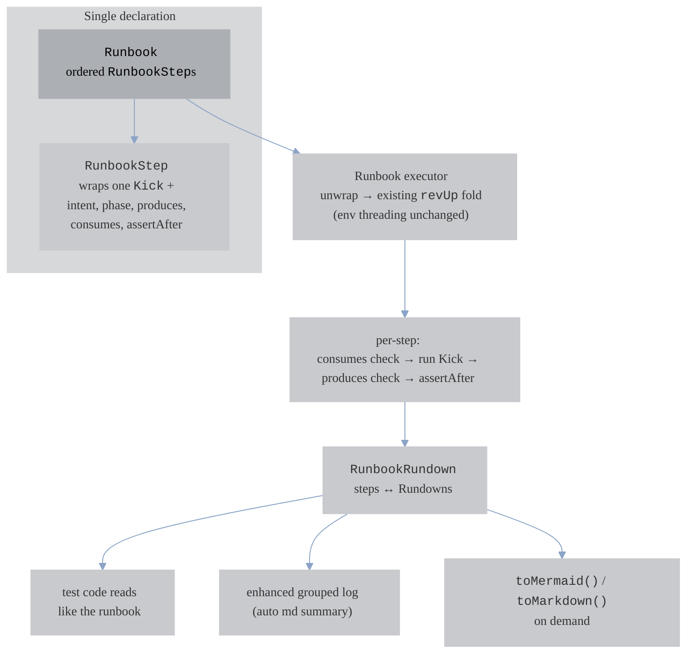

# Runbook Legibility — making the test's collection-chain readable

**Date:** 2026-07-13
**Status:** Design approved, pending spec review
**Author:** Gopal S Akshintala (with Claude)

## Problem

A ReVoman test acts as a *runbook*: it chains loosely-coupled Postman collections
(separate files on disk) into an ordered story — *login → set policy → seed
fixture → schedule (act) → control*. Today that runbook is **implicit**, spread
across three places that the test reader must mentally reassemble:

1. A separate config file (`ReVomanConfigForWfs.java`) declaring one `Kick`
   constant per collection.
2. The **order** those constants appear in a flat `revUp(...)` vararg call.
3. The constant **names** plus hand-written comment blocks.

Nothing in the test surfaces *what each step means*, *what data it hands to the
next step*, or *which step is the act-step under test*. The coupling between
collections (env keys produced by one, consumed by the next) is invisible.

Concretely, today's WFS test reads:

```java
final var doubleBookRundown =
    ReVoman.revUp(
        (rundown, ignore) ->
            assertThat(rundown.firstUnIgnoredUnsuccessfulStepReport()).isNull(),
        AUTH_CONFIG,
        AVAILABILITY_OP_HOURS_POLICY_CONFIG,
        DOUBLE_BOOK_FIXTURE_CONFIG,
        DOUBLE_BOOK_NON_REQUIRED_SCHEDULE_CONFIG,
        DOUBLE_BOOK_REQUIRED_CONFLICT_SCHEDULE_CONFIG);
```

The story ("log in, apply the availability policy, seed the double-book fixture,
run the two schedule act-steps") lives only in the constant names and the config
file's comments.

## Goal

Make the runbook legible from **one declaration**, surfaced three ways from that
single source of truth:

1. **The test code** — a fluent DSL that reads like the runbook.
2. **The log** — a grouped, narrated, glyph-rich run log.
3. **A generated view** — a mermaid sequence diagram / markdown runbook, on demand.

Non-goals: replacing `Kick`; forcing migration; replacing the test writer's
Truth assertions.

## Solution overview

A thin **Runbook** layer wraps each `Kick` with narration and drives the existing
multi-kick `revUp` fold. `Kick` stays the per-collection unit (*how a collection
runs*); a `RunbookStep` adds the story layer (*what this step means*).



## New types

All in `com.salesforce.revoman.input.config` (next to `Kick`), as Immutables
(`@Value.Immutable`, same `configure()`/`off()` style annotation as `KickDef`),
except the output type which lives under `com.salesforce.revoman.output`.

| Type | Kind | Responsibility |
|------|------|----------------|
| `Runbook` | `@Value.Immutable`, `input.config` | Ordered list of `RunbookStep`s + optional runbook name. The whole story. |
| `RunbookStep` | `@Value.Immutable`, `input.config` | Wraps ONE `Kick` + narration: `intent`, `phase`, `consumes`, `produces` (keys or key→value), `underTest`, `assertAfter`. |
| `Phase` | `enum`, `input.config` | `SETUP, SEED, ACT, ASSERT, CLEANUP`. Mirrors today's comment blocks. |
| `RunbookRundown` | output, `com.salesforce.revoman.output` | The executed runbook: steps paired with their `Rundown`s + `toMermaid()` / `toMarkdown()`. |

**Boundary:** `RunbookStep` never duplicates `Kick` fields. `Kick` = *how a
collection runs* (paths, hooks, adapters, halt rules). `RunbookStep` = *what this
step means in the story*.

## DSL

### Kotlin — fluent receiver DSL (idiomatic type-safe builder)

```kotlin
val runbook = Runbook {
    step {
        intent = "login as admin"
        phase = SETUP
        kick = AUTH_CONFIG
        produces("authToken", "userId")
    }
    step {
        intent = "seed double-book fixture"
        phase = SEED
        kick = DOUBLE_BOOK_FIXTURE_CONFIG
        consumes("authToken")
        produces("accountId", "shiftIds")
    }
    step {
        intent = "schedule double-book non-required"
        phase = ACT
        kick = DOUBLE_BOOK_SCHEDULE_CONFIG
        underTest()                                          // → ◆ ★ UNDER TEST
        consumes("accountId", "shiftIds")
        produces("doubleBookNonRequiredSchedulingStatus" to "Success")   // key→value
        assertAfter { rundown, env ->
            assertThat(env).containsEntry("doubleBookNonRequiredSchedulingStatus", "Success")
        }
    }
}

val rundown: RunbookRundown = ReVoman.revUp(runbook)
```

- `Runbook { }` = top-level `fun Runbook(block: RunbookBuilder.() -> Unit): Runbook`.
- `step { }` = `fun RunbookBuilder.step(block: StepSpec.() -> Unit)`.
- `intent`/`phase`/`kick` are `var` properties; `produces`/`consumes`/`underTest`/
  `assertAfter` are methods on the receiver.
- `@DslMarker` scopes receivers so an inner `step { }` cannot call outer-builder
  methods.
- A `step { }` with no `kick` fails at build with a clear message.

### Java — `configure()`/`off()` builder

Java has no lambda-with-receiver, so a true `step { intent = ... }` block is
impossible. The idiomatic Java ceiling is a `Consumer<StepSpec>` configurator —
type-safe, no extra dependency. (Double-brace init is an anti-pattern; builder
libraries like Immutables/Lombok only generate method chains, adding a dep
without adding receiver blocks.)

```java
final var runbook = Runbook.configure()
    .step("login as admin", SETUP, AUTH_CONFIG,
        s -> s.produces("authToken", "userId"))
    .step("seed double-book fixture", SEED, DOUBLE_BOOK_FIXTURE_CONFIG,
        s -> s.consumes("authToken").produces("accountId", "shiftIds"))
    .step("schedule double-book non-required", ACT, DOUBLE_BOOK_SCHEDULE_CONFIG,
        s -> s.underTest()
              .consumes("accountId", "shiftIds")
              .produces(Map.of("doubleBookNonRequiredSchedulingStatus", "Success"))
              .assertAfter((rundown, env) -> assertThat(env)
                  .containsEntry("doubleBookNonRequiredSchedulingStatus", "Success")))
    .off();

final var rundown = ReVoman.revUp(runbook);
```

Both front doors build the **same** immutable model — the Kotlin layer only
accumulates into what the Java builder produces, so there is nothing to keep in
sync beyond the builder surface.

### Entry point

`revUp(Runbook)` is a **new opt-in overload**. Existing `revUp(vararg Kick)` and
`revUp(List<Kick>)` are untouched — no test is forced to migrate.

## Data-flow contract (subset / at-least semantics)

Full env enumeration would be brittle (Postman scripts write many keys). Instead,
declare **only the handoff keys that matter** to the story:

- **`consumes(keys…)`** — before the step runs, assert the accumulated env
  `containsAtLeast` these keys. Missing → `RunbookContractFailed` event + halt
  with `missing consumed: [k]` naming the step.
- **`produces(keys…)`** — after the step's `Rundown`, assert env `containsAtLeast`
  these keys.
- **`produces(key to value)`** — additionally assert the value equals (env
  `getAsString`/equals). Key-only when the value is omitted. Mix freely.
- **Empty declarations** → pure narration, no check. Enforcement is opt-in
  *per key* by what you list.

Extra env churn never fails a step. These checks are **complementary** to the
test writer's Truth assertions, not a replacement.

### `assertAfter`

`assertAfter { rundown, env -> }` runs after that step, receiving the step's
`Rundown` + the accumulated `MutableEnv` — the same objects the writer already
asserts on, relocated next to the step. A thrown `AssertionError` (Truth) fails
the run at that step. Complementary to the contract checks and to the whole-run
`postExeHook`.

### Per-step order & failure mode

Per step: **`consumes` check → execute Kick (existing `revUp`) → `produces`
check → `assertAfter`**. The **first** contract or `assertAfter` breach **halts**
the runbook at that step — downstream steps depend on it, so continuing only adds
noise. The log marks `✘` at the exact broken handoff.

## Logging overhaul

The runbook's narration data becomes log output, so a Gradle/JUnit log reads like
the runbook rather than a flat wall of HTTP. This reuses the existing
`RunLogSink` / `StepEvent` pipeline — no new sink type.

### New coarse-grained events

Added to the `StepEvent` sealed interface, bracketing the existing fine-grained
per-request events (`StepStarted`/`StepFinished`):

| Event | Carries |
|-------|---------|
| `PhaseEntered` | `phase` |
| `RunbookStepStarted` | `name`, `intent`, `phase`, `consumes`, `underTest` |
| `RunbookStepFinished` | `name`, `outcome`, `produced` (+ values), `tookMs` |
| `RunbookContractFailed` | `name`, `missingProduced`, `missingConsumed` |

Any existing custom sink already handles new events through its sealed `when`.

### Symbol & grouping redesign (full overhaul)

Design rules: (1) fixed-width left gutter so a reader scans one column; (2)
tree/rule glyphs group related lines; (3) reserved markers highlight the
important stuff (act-step-under-test, failures, contract breaks); (4) data-flow
arrows at every handoff. Terminal/Gradle logs are monospace with no guaranteed
color, so this rides on glyphs + indentation alone.

| Meaning | Today | New |
|---------|-------|-----|
| Phase boundary | *(none)* | `━━ SEED ━━━━━━━━` |
| Runbook step open | *(none)* | `┌ ▶ <intent>` |
| Act-step open (under test) | *(none)* | `┌ ◆ <intent>  ★ UNDER TEST` |
| child request start | `→ STEP` | `│ · <METHOD path>` |
| child request done | `── STEP [200] SUCCESS` | `│   200 OK 243ms` |
| runbook step OK | *(none)* | `└ ✔ <intent>` |
| runbook step FAIL | *(none)* | `└ ✘ <intent>` |
| ledger reuse | `↩ LEDGER-SKIP` | `│ ↺ reused {…}` |
| request skip | `⤫ REQ-SKIP` | `│ ⊘ skipped` |
| jump | `↪ JUMP a→b` | `│ ↪ a → b` |
| stop | `■ STOP` | `■ STOP: <reason>` |
| loop budget | `✖ LOOP-BUDGET` | `✖ LOOP-BUDGET budget=N` |
| consumes (in) | `consumed=[…]` | `⟵ authToken` on step open |
| produces (out) | `produced=[…]` | `⟶ schedulingStatus=Success` on step close |
| contract breach | *(none)* | `│ ⚠ CONTRACT missing produced: …` |

**After** (grouped, narrated, highlighted):

```
━━ SETUP ━━━━━━━━━━━━━━━━━━━━━━━━━━━━━━━━━━━━━━━━━━━━
┌ ▶ login as admin                          ⟵ —
│   POST auth/login              200 OK    243ms
└ ✔ login as admin                          ⟶ authToken, userId
━━ SEED ━━━━━━━━━━━━━━━━━━━━━━━━━━━━━━━━━━━━━━━━━━━━━
┌ ▶ seed double-book fixture                ⟵ authToken
│   POST composite/graph         201 OK    512ms
│ ↺ composite/query              reused {accountId}
└ ✔ seed double-book fixture                ⟶ accountId, shiftIds
━━ ACT ━━━━━━━━━━━━━━━━━━━━━━━━━━━━━━━━━━━━━━━━━━━━━━
┌ ◆ schedule double-book non-required       ⟵ accountId, shiftIds   ★ UNDER TEST
│   POST actions/schedule        200 OK    876ms
└ ✔ schedule double-book non-required       ⟶ schedulingStatus=Success
```

Failure case makes the broken handoff jump out:

```
┌ ◆ schedule required control               ⟵ accountId, shiftIds   ★ UNDER TEST
│   POST actions/schedule        200 OK    654ms
│ ⚠ CONTRACT  missing produced: schedulingStatus
└ ✘ schedule required control               FAILED
```

### Plain `revUp` reimagined too

Even a plain `revUp(vararg Kick)` / `revUp(List<Kick>)` call (no `Runbook`, no
narration) gets the reimagined rendering: one group per `Kick`/collection, step
name derived from the template path, no phase/intent lines, but the **same** tree
layout + status column. One rendering engine, two levels of richness depending on
whether narration is present.

### Scope

New glyphs and the per-request rewrites live in `ConsoleRunLogSink.render()`
(new `when`-arms for the coarse events + rewritten arms for existing events). The
event *data* for existing events is unchanged; existing `ConsoleRunLogSink` tests
are updated to the new rendering. `◆`/`★` fire when a step's phase is `ACT` or
its explicit `underTest` flag is set.

## Generated view

`RunbookRundown` exposes:

- **`toMermaid()`** — a sequence diagram: participants are phases; each step is an
  arrow labeled with its intent; produces/consumes annotated; `◆` act-steps
  flagged. Themed per the repo's mermaid convention when written to docs.
- **`toMarkdown()`** — a table/checklist runbook: phase → step → intent →
  consumes → produces → outcome.

Both are pure functions of the declared `Runbook` (renderable even before running)
with executed outcomes overlaid when present.

**Emission:** after a run, the enhanced log **auto-prints** the compact markdown
runbook summary (the log is already narrating). Mermaid and file output stay
**on-demand** — the methods return strings; the caller (or a future Gradle task)
decides where to write. No forced file I/O.

## Migration

Mechanical and optional:

1. Wrap each existing `revUp` vararg entry in a `step { }` (Kotlin) or
   `.step(...)` (Java), adding `intent`/`phase` and, for the handoff keys that
   matter, `consumes`/`produces`.
2. The `Kick` constants (e.g. `ReVomanConfigForWfs`) stay exactly as-is; order is
   preserved.
3. The whole-run `postExeHook` either stays a `revUp` arg or moves into the last
   step's `assertAfter` — writer's choice.

No test is forced to migrate: `revUp(vararg Kick)` / `revUp(List<Kick>)` remain.

## Testing

- **DSL build** — Kotlin `Runbook { step { } }` and Java `configure().step().off()`
  produce equivalent immutables; missing-`kick` fails at build.
- **Contract semantics** — `consumes`/`produces` subset checks (present, missing,
  extra-ignored); `produces(key to value)` pass/fail; empty = no check.
- **Failure mode** — first breach halts at the right step; downstream steps do not
  run; `RunbookContractFailed` emitted.
- **Executor equivalence** — a `Runbook` of N steps threads env identically to
  today's `revUp(vararg Kick)` of the same N kicks (regression guard).
- **Logging** — new `StepEvent` arms render the expected glyphs/grouping;
  `ConsoleRunLogSink` snapshot updated; plain-`revUp` grouping renders.
- **Generated view** — `toMermaid()`/`toMarkdown()` output for a known runbook;
  auto-md-summary appears in the log.
- **Migration proof** — port one real test (e.g. `WfsDoubleBookHelperE2ETest`)
  to the DSL and assert identical behavior.

## Open considerations (for spec review)

- Exact `Phase` set — are 5 enough, or should `Phase` be an open label?
- Whether `RunbookRundown` should also implement/extend `List<Rundown>` for
  drop-in compatibility with code that reads today's `revUp` return.
