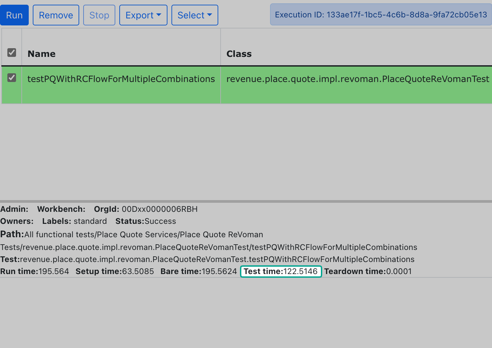

## Execution Performance

This entire execution of **~75 steps**, including **10 async steps**, took a mere **122 seconds** on localhost.
This can be much better in auto-build environments.

:::caution
ReVoman internally is very lightweight, and the execution times are proportional
to how your server responds or your network speed.
:::
