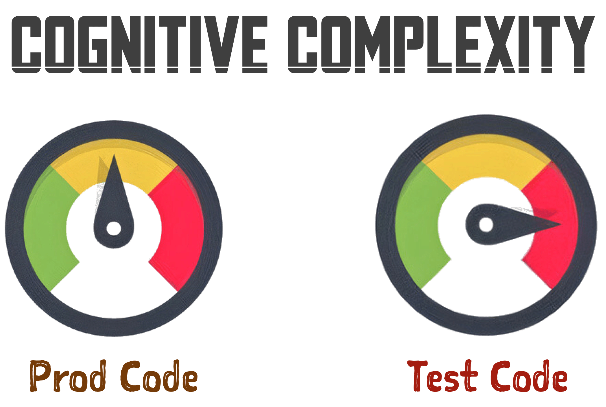

## Why not use Newman, Postman CLI, or ijhttp?

ReVoman may be similar to [Newman](https://learning.postman.com/docs/collections/using-newman-cli/command-line-integration-with-newman),
[Postman CLI](https://learning.postman.com/docs/postman-cli/postman-cli-overview/#comparing-the-postman-cli-and-newman),
or [ijhttp](https://www.jetbrains.com/help/idea/http-client-cli.html)
when it comes to executing API workflow templates, but the _similarities end there_.

- **Newman and Postman CLI are built for Node** and cannot be executed within a JVM. Even if you run them through some workaround, there are no easy ways to measure code coverage or assert results on your JVM stack.
- **ijhttp** runs `.http` files from the command line but offers no JVM integration, no type-safe response handling, and no programmatic hooks.
- **Built for the JVM**, ReVoman fits naturally within your current JVM stack.
- Its [Type Safety](/ReVoman/guides/type-safety/) bridges the gap between strongly-typed JVM code and flexible JSON.
- It has features like [Pre/Post Hooks](/ReVoman/guides/hooks/) that let you plug in your custom JVM code in-between the execution. The [Rundown](/ReVoman/getting-started/rundown/) is richer in providing execution information than newman/postman-cli/ijhttp reports.
- It supports **multiple template formats** — [Postman collections](/ReVoman/guides/template-formats/#postman-collections) and [JetBrains `.http` files](/ReVoman/guides/template-formats/#jetbrains-http-files) — with a clean abstraction that makes adding more formats straightforward.

:::tip
Read more about what makes ReVoman special in the [Unique Selling Points](/ReVoman/about/usp/) section.
:::

---

## The Problem

- The majority of JVM SaaS applications are REST-based. But the API automation is done through a Mul-**T**-verse of Integration/Functional tests, E2E tests and Manual tests, each with its own frameworks, tools, and internal utilities, testing almost the same code flow.
- These custom alien automation frameworks, often built using low-level tools like [REST Assured](https://rest-assured.io/), are specific to a service or domain and are rigid to reuse, extend, and difficult to maintain.
- This automation competes on cognitive complexity and learning curve with the Prod code, and mostly, automation wins.
- After a point, the API orchestration/automation may deviate from its purpose of augmenting real end-user interaction and turns into a foot-chain for development.

---

## The Solution

Contrary to these custom frameworks,
almost every team already uses tools like [Postman](https://www.postman.com/product/what-is-postman) or [JetBrains HTTP Client](https://www.jetbrains.com/help/idea/http-client-in-product-code-editor.html) for manual testing their APIs.
These tools produce structured templates — Postman collection JSON files or `.http` files — that contain all the information about your APIs and the order
in which they need to be executed.
Leveraging these templates can mitigate writing a lot of code as we translate manual steps into automation.

> - How _productive_ would it be, if you could plug the API workflow templates you already created for manual testing and execute them through your JVM tests?
>
> - How about a Universal API orchestration/automation tool that promotes low code and low cognitive complexity and strikes a balance between flexibility and ease of use?
