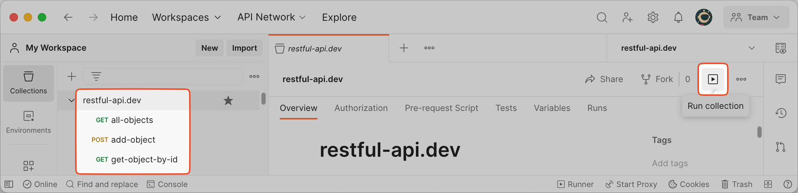

## API Orchestration/Automation with ReVoman

### Template-Driven Testing

#### Why Postman Templates?

The exported Postman collection JSON file is referred to as a **Postman template**, as it contains some placeholders/variables in the `{{variable-key}}` pattern. You can read more about it [here](https://learning.postman.com/docs/sending-requests/variables/).

This is a popular and proven pattern that interconnects multiple endpoint requests like a Graph. This is not unique to Postman, but Postman is popular and familiar in the dev community and has a full-blown UI, which makes it an attractive choice to start with supporting Postman templates. But that said, ReVoman is modular, and the implementation is not coupled with any Postman related contracts. **In the future, we can think of supporting more template formats.**

You can _kick off_ this **Template-Driven Testing** by invoking `ReVoman.revUp()`, supplying your Postman templates and environments, and all your customizations through a **Configuration**:

```java
final var rundown =
    ReVoman.revUp(
        Kick.configure()
        ...
        .off())
```

### A Simple Example

Here is a simple Exported Postman collection and Environment JSON files, to hit a free public [RESTFUL-API](https://restful-api.dev/).
You can import and manually test this collection through the `Run collection` button like this:



You can automate the same using ReVoman in a JUnit test by supplying the template and environment path:

```java title="RestfulAPIDevTest.java"
@Test
@DisplayName("restful-api.dev")
void restfulApiDev() {
    final var rundown =
        ReVoman.revUp( // (1)
            Kick.configure()
                    .templatePath(PM_COLLECTION_PATH) // (2)
                    .environmentPath(PM_ENVIRONMENT_PATH) // (3)
                    .off());
    assertThat(rundown.firstUnIgnoredUnsuccessfulStepReport()).isNull(); // (4)
    assertThat(rundown.stepReports).hasSize(4); // (5)
}
```

1. `revUp` is the method to call passing a configuration, built as below
2. Supply an exported Postman collection JSON file path
3. Supply an exported Postman environment JSON file path
4. Assert that the execution doesn't have any failures
5. Run more assertions on the [Rundown](/ReVoman/getting-started/rundown/)

:::tip
Other simple examples to see in action: [PokemonTest.java](https://github.com/salesforce-misc/ReVoman/blob/master/src/integrationTest/java/com/salesforce/revoman/integration/pokemon/PokemonTest.java)
:::
