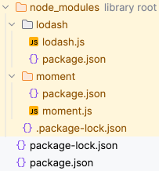

import { Tabs, TabItem } from '@astrojs/starlight/components';

ReVoman executes JavaScript embedded in your templates on the JVM via GraalVM. Both Postman scripts and JetBrains HTTP Client handlers are supported, and their JavaScript APIs are available simultaneously — you can use either style regardless of template format.

## Script Types by Format

<Tabs>
  <TabItem label="Postman Scripts">
    Postman lets you write custom JavaScript in [Pre-req and Post-res tabs](https://learning.postman.com/docs/writing-scripts/script-references/test-examples/) that get executed before and after a step respectively. When you export the collection as a template, these scripts come bundled.

    - Pre-req JS script is executed as the first step before Unmarshall request
    - Post-res JS script is executed right after receiving an HTTP response

    ```javascript title="Postman test script"
    var responseJson = pm.response.json();
    pm.environment.set("objId", responseJson.id);
    pm.environment.set("productName", responseJson.name);
    ```

    ```javascript title="Postman pre-request script"
    var moment = require("moment");
    pm.environment.set("$currentDate", moment().format("YYYY-MM-DD"));
    ```
  </TabItem>
  <TabItem label="JetBrains HTTP Client Handlers">
    JetBrains `.http` files support [response handlers](https://www.jetbrains.com/help/idea/exploring-http-syntax.html#response-redirect) (`> `) and pre-request handlers (`< `).

    **Response handler** — runs after receiving a response:

    ```http
    GET https://api.example.com/data

    > 
    ```

    **Pre-request handler** — runs before sending the request:

    ```http
    < 
    GET https://api.example.com/data
    ```

    ### HTTP Client JavaScript API

    Available in response handlers:

    | Object | Method | Description |
    |--------|--------|-------------|
    | `client.global` | `.set(key, value)` | Set an environment variable |
    | `client.global` | `.get(key)` | Get an environment variable |
    | `client` | `.test(name, fn)` | Define a named test |
    | `client` | `.assert(condition, msg)` | Assert a condition |
    | `client` | `.log(message)` | Log a message |
    | `response` | `.body` | Parsed JSON object (for JSON responses) or raw string |
    | `response` | `.status` | HTTP status code |
    | `response` | `.headers.valueOf(name)` | Get header value (case-insensitive) |
    | `response` | `.contentType` | Content-Type header value |

    :::note
    In ReVoman, `response.body` returns a parsed JSON object for JSON content types (matching `ijhttp` behavior). For non-JSON responses, it returns the raw string.
    :::
  </TabItem>
</Tabs>

---

## `npm` modules to use with `require(...)` (Postman only)

ReVoman supports using `npm` modules inside your Postman Pre-req and Post-res JS scripts. Install `npm` modules in any folder and supply an absolute or relative path (relative to Project directory) to the parent folder containing the `node_modules` folder using `nodeModulesPath(...)`:

### Install `moment` with npm

```shell
npm install moment
```

### Use inside pre-req and post-res scripts

```javascript
var moment = require("moment")
var _ = require('lodash')

pm.environment.set("$currentDate", moment().format(("YYYY-MM-DD")))
var futureDateTime = moment().add(365, 'days')
pm.environment.set('$randomFutureDate', futureDateTime.format('YYYY-MM-DD'))

pm.environment.set("$quantity", _.random(1, 10))
```

:::caution
`npm` modules are NOT supported in JetBrains HTTP Client handlers. The HTTP Client JavaScript environment only supports standard ECMAScript built-ins (`Date`, `Math`, `JSON`, `RegExp`, etc.). Use vanilla JavaScript in `.http` response/pre-request handlers.
:::

:::caution
It is not supported to load `node_modules` from jar. For example, `/Users/username/some-path/revoman-root/build/libs/revoman-root-0.40.0.jar!/js` is an invalid path. [Refer to this known issue](https://graalvm.slack.com/archives/CN9L59P61/p1710937088860679?thread_ts=1710767437.443019&cid=CN9L59P61).
:::

:::tip
- `node_modules` adds a lot of files to check in. You may replace them with a single distribution file.



- If `node_modules` is ignored on your git repo, you can force-add to check in using the command `git add --all -f <path>/node_modules`.
:::

:::danger
The recommendation is not to add too much code in scripts/handlers, as it's not intuitive to troubleshoot through debugging. Use it for simple operations that can be understood without debugging, and use [Pre-Step/Post-Step Hooks](/ReVoman/guides/hooks/) for any non-trivial operations, which are intuitive to debug.
:::
