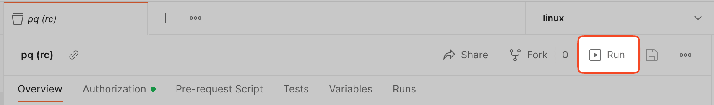
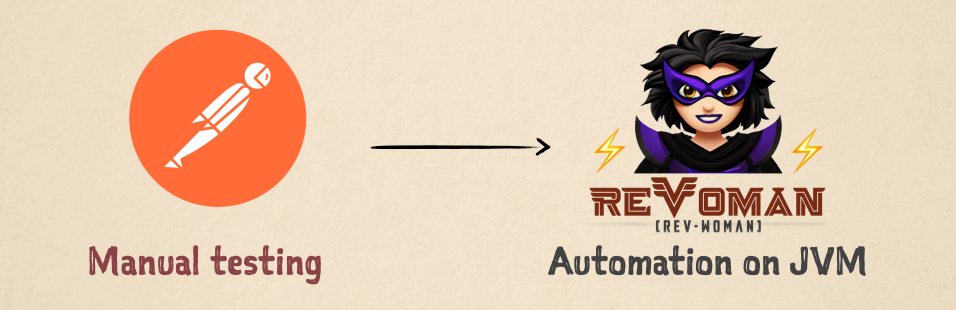

import { Tabs, TabItem, Card, CardGrid } from '@astrojs/starlight/components';

Think of it as **Postman for JVM** (Java/Kotlin) -- it emulates the
[Postman Collection Runner](https://learning.postman.com/docs/collections/running-collections/intro-to-collection-runs/)
through a Java program, essentially translating your manual testing into automation, without any loss or resistance.
**But it's even better!**





It strikes a balance between _flexibility_ provided by low-level tools like
[REST Assured](https://rest-assured.io/) or [Cucumber](https://cucumber.io/) and _ease of use_
provided by UI tools like [Postman](https://www.postman.com/).

The fundamental principle of this tool is **Template-Driven Testing**,
where the Postman collection JSON is the template.
Which means the collections used in JVM automation can be maintained
to always be ready for manually trying them out by importing into Postman.

:::note
NO licensed Postman SDKs are used inside this project. This is written ground up natively in JVM.
:::

---

## Features

<CardGrid>
  <Card title="Template-Driven" icon="document">
    Use your existing Postman collections as test templates. No proprietary syntax or formats required.
  </Card>
  <Card title="Type-Safe" icon="approve-check">
    Bridges the gap between strongly-typed JVM code and flexible JSON with built-in marshalling and unmarshalling.
  </Card>
  <Card title="Low Code" icon="pencil">
    Approximately 89% less code compared to traditional integration/E2E tests. Low cognitive complexity and transparent.
  </Card>
  <Card title="CI/CD Ready" icon="rocket">
    Works like any JVM library -- plug into JUnit tests or integration tests. No extra setup needed for CI/CD.
  </Card>
</CardGrid>

---

## Installation

<Tabs>
  <TabItem label="Maven">
    ```xml
    <dependency>
        <groupId>com.salesforce.revoman</groupId>
        <artifactId>revoman</artifactId>
        <version>0.82.0</version>
    </dependency>
    ```
  </TabItem>
  <TabItem label="Gradle Kts">
    ```kotlin
    implementation("com.salesforce.revoman:revoman:0.82.0")
    ```
  </TabItem>
  <TabItem label="Bazel">
    ```python
    "com.salesforce.revoman:revoman"
    ```
  </TabItem>
</Tabs>

:::caution
Minimum Java version required: **21**
:::

---

## Tech Talk

[](https://www.youtube.com/watch?v=YxeRddSFkxc&list=PLrJbJ9wDl9EC0bG6y9fyDylcfmB_lT_Or&index=2)

Tech talk given at [Open Source Conf -- 2023](https://www.opensourceindia.in/osi-speakers-2023/gopala-sarma-akshintala/) |
[Slide deck](https://speakerdeck.com/gopalakshintala/revoman-a-template-driven-api-automation-tool-for-jvm)
