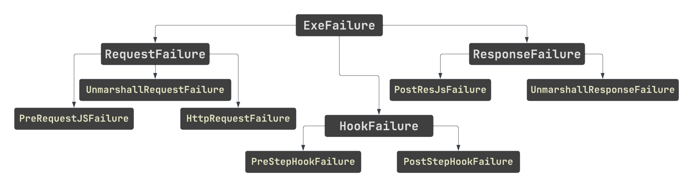

Here is the failure hierarchy of what can go wrong during step execution:

These failures are assertion-friendly and provide clear messages with necessary stack traces to help you troubleshoot.

See the [Step Procedure](/ReVoman/troubleshooting/#step-procedure) for how failures are captured during each stage of execution.
