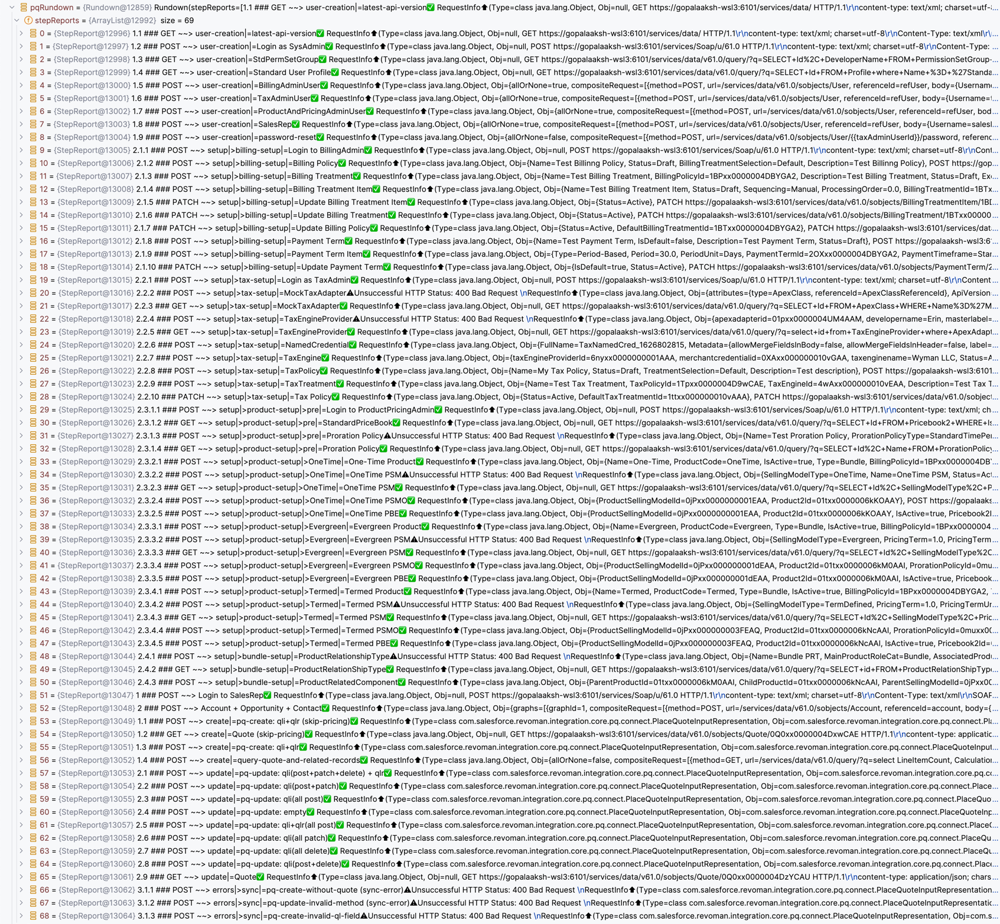
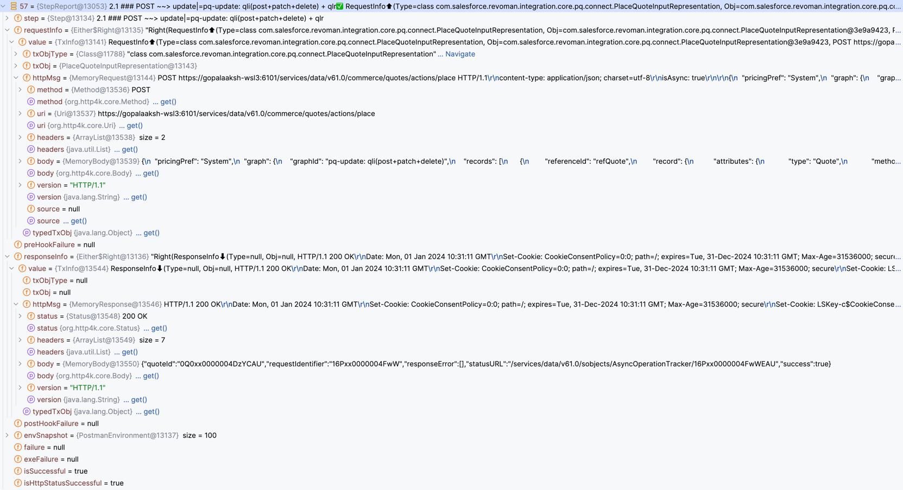
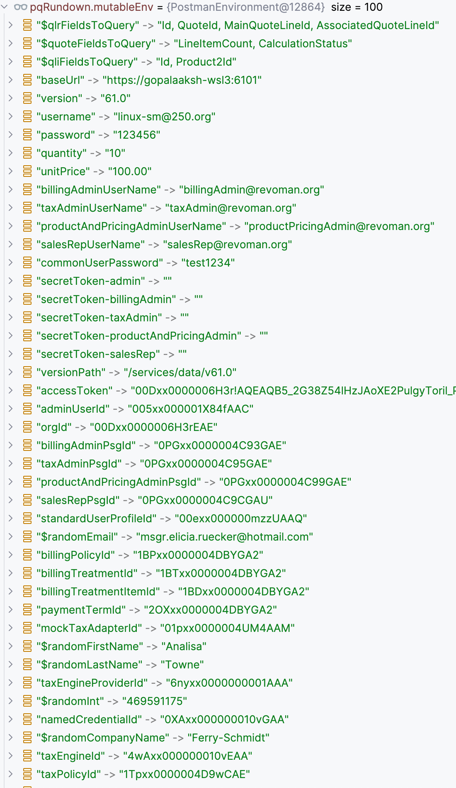
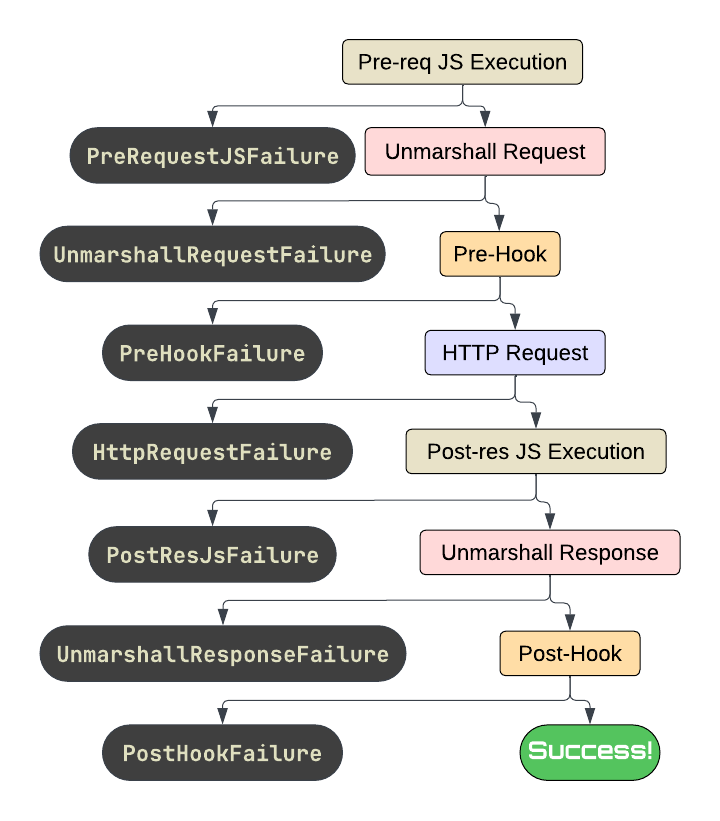

ReVoman has a particular emphasis on the debugging experience.

## IDE Debugger View

Here is what a debugger view of a [Rundown](/ReVoman/getting-started/rundown/) looks like:



Let's zoom into a detailed view of one of these Step reports, which contains complete Request and Response info along with failure information if any:



Here are the environment **key-value** pairs accumulated along the entire execution and appended to the environment from the file and `dynamicEnvironment` supplied:



## Step Procedure

A Step waterfalls through all these stages and if there is any exception at any stage,
the step procedure fails-fast, and ReVoman captures the `Failure` in the respective StepReport:



:::note
- `HttpRequestFailure` happens if there is an exception while making the request. It is different from HTTP Error response.
- HTTP Success or Error response is determined by default with HTTP Status Code (SUCCESSFUL: `200 <= statusCode <= 299`).
- HTTP Error response does **NOT** halt the execution of steps by default.
- You can configure this behavior using [Execution Control](/ReVoman/guides/execution-control/).
- If [Polling](/ReVoman/guides/polling/) is configured for a step, it is executed after Post-Step Hooks. A `PollingFailure` is captured in the `StepReport` if polling fails.
:::

## Execution Timing Metrics

ReVoman captures detailed execution timing metrics for each sub-step of the Step Procedure.
These metrics help you identify performance bottlenecks, track response times, and analyze the time spent in different phases of your API workflow.

Each `StepReport` includes an `exeTimings` map that records the `Duration` for each executed sub-step:

```kotlin
exeTimings: Map<ExeType, Duration>
```

### Sub-step Types (ExeType)

- `PRE_REQ_JS` — Time spent executing Pre-request JavaScript
- `UNMARSHALL_REQUEST` — Time spent unmarshalling and transforming the request (including regex replacements)
- `PRE_STEP_HOOK` — Time spent executing Pre-step hooks
- `HTTP_REQUEST` — Total HTTP round-trip time (includes both request and response)
- `POST_RES_JS` — Time spent executing Post-response JavaScript (tests)
- `UNMARSHALL_RESPONSE` — Time spent unmarshalling the response
- `POST_STEP_HOOK` — Time spent executing Post-step hooks
- `POLLING` — Time spent in polling logic (if configured)

:::note
- Only sub-steps that actually execute are included in the timing map
- If a step fails early, subsequent sub-steps won't have timing entries
- The `HTTP_REQUEST` timing captures the complete HTTP round-trip, measuring from just before the request is fired until the response is received
- All timings are captured using `java.time.Duration` for precision
:::

### JSON Serialization

When serializing a `Rundown` to JSON using `toJson()`, execution timings are included at `STANDARD` verbosity level and above:

```json
{
  "stepReports": [
    {
      "stepName": "Create User",
      "exeTimings": {
        "pre-req-js": 5,
        "unmarshall-request": 12,
        "http-request": 234,
        "post-res-js": 3,
        "unmarshall-response": 8,
        "post-step-hook": 15
      }
    }
  ]
}
```

- Keys use kebab-case format (e.g., `"pre-req-js"`, `"http-request"`)
- Values are in milliseconds
- Timings are **not** included in `SUMMARY` verbosity
